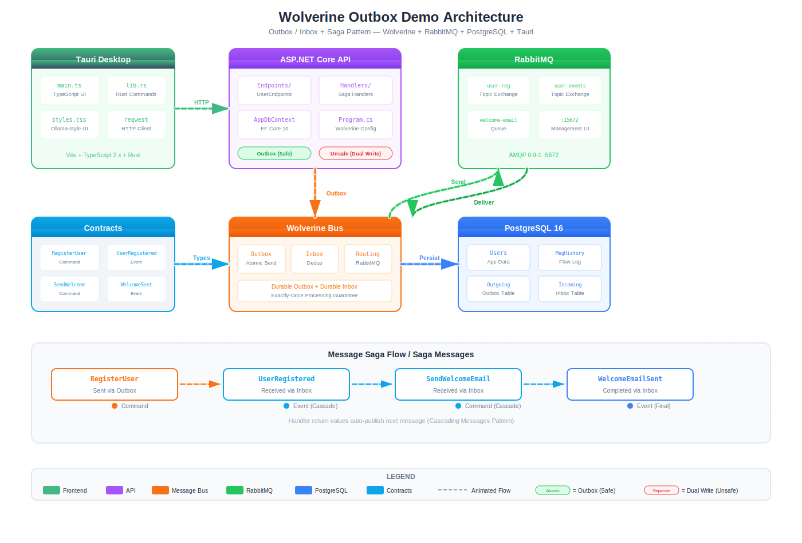

# Wolverine Outbox Demo

Demonstrates the **Wolverine Outbox/Inbox pattern** with RabbitMQ and PostgreSQL, featuring a Tauri desktop frontend.

## Architecture



## Message Saga Flow

```
RegisterUser (Outbox) → UserRegistered (Inbox) → SendWelcomeEmail (Inbox) → WelcomeEmailSent (Inbox)
```

Handlers use Wolverine's **cascading message** pattern: returning a message from a handler automatically publishes it.

## Two Endpoint Patterns

| Pattern | Endpoint | Description |
|---------|----------|-------------|
| **Outbox (Safe)** | `POST /api/users/register-outbox` | Atomic DB write + message publish via `IDbContextOutbox` |
| **Unsafe (Dual Write)** | `POST /api/users/register-unsafe` | Separate `SaveChangesAsync` + `SendAsync` (dual-write risk) |

## Tech Stack

| Layer | Technology |
|-------|-----------|
| Frontend | Tauri 2.x (TypeScript + Rust) |
| API | ASP.NET Core 10 Minimal API |
| Message Bus | Wolverine 5.32 |
| Broker | RabbitMQ 3.13 |
| Database | PostgreSQL 16 |
| ORM | EF Core 10 |

## Project Structure

```
WolverineOutboxDemo/
├── WolverineOutboxDemo.Api/          # ASP.NET Core host
│   ├── Endpoints/                    # Minimal API endpoints
│   ├── Handlers/                     # Wolverine message handlers
│   ├── Data/                         # EF Core DbContext
│   └── Models/                       # Entity models
├── WolverineOutboxDemo.Contracts/    # Shared message types (records)
├── WolverineOutboxDemo.Tests/        # xUnit test project
├── frontend/tauri-frontend/          # Tauri desktop app
│   ├── src/                          # TypeScript UI
│   └── src-tauri/src/                # Rust backend (reqwest HTTP)
└── docker-compose.yml                # PostgreSQL + RabbitMQ
```

## Key Wolverine Configuration

```csharp
// Atomic DB save + message publish
opts.UseEntityFrameworkCoreTransactions();
opts.Policies.UseDurableOutboxOnAllSendingEndpoints();
opts.Policies.UseDurableInboxOnAllListeners();
opts.PersistMessagesWithPostgresql(connectionString);
```

## Getting Started

```bash
# Start infrastructure
docker compose up -d

# Apply migrations
dotnet ef database update --project WolverineOutboxDemo.Api

# Run the API
dotnet run --project WolverineOutboxDemo.Api

# Run Tauri frontend (separate terminal)
cd frontend/tauri-frontend && npx tauri dev
```

## Infrastructure

- PostgreSQL: `localhost:5432` (database: `wolverine_demo`)
- RabbitMQ: `localhost:5672` (management UI: `localhost:15672`, guest/guest)

## API Endpoints

| Method | Path | Description |
|--------|------|-------------|
| POST | `/api/users/register-outbox` | Register user via Outbox pattern |
| POST | `/api/users/register-unsafe` | Register user (dual-write risk) |
| GET | `/api/users` | List all users |
| GET | `/api/users/{id}` | Get user by ID |
| GET | `/api/message-history` | Message flow history |
| GET | `/api/outbox` | Wolverine outbox envelopes |
| GET | `/api/inbox` | Wolverine inbox envelopes |
